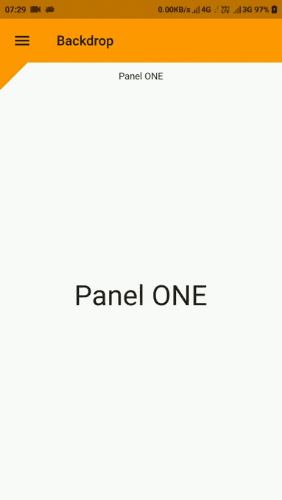
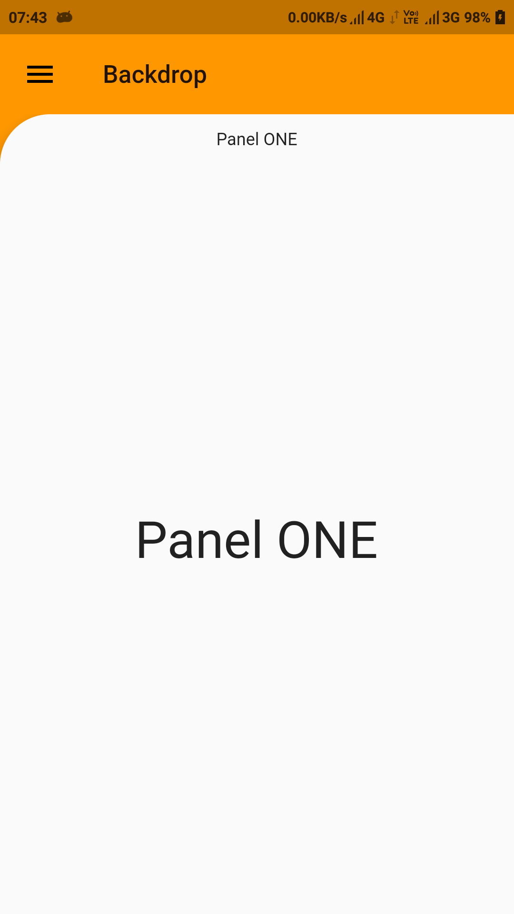
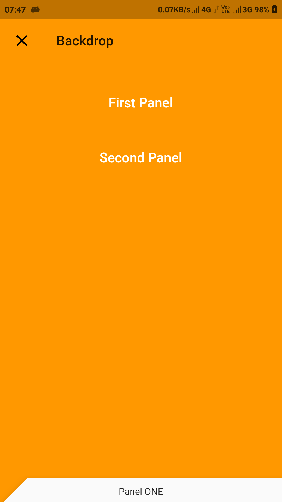

# flutter_backdrop

This package is used for implementing Backdrop widget in Flutter easily.

You can add properties like-

* frontLayer
* backLayer
* frontHeader
* borderRadius
* shape
* frontHeaderHeight
* titleVisibleOnPanelClosed
* frontPanelPadding
* panelVisibleInitially
* toggleFrontLayer
* appBarLeadingMenuIcon
* appBarAnimatedLeadingMenuIcon
* appBarAutomaticallyImplyLeading
* appBarTitle
* appBarActions
* appBarBackgroundColor
* appBarIconTheme
* appBarTextTheme
* appBarCenterTitle
* appBarTitleSpacing
* appBarElevation

to manipulate the backdrop easily.

Each property has been defined in package.

Refer to the example to create something like this: 

Or modify the borderRadius property to get this:

Or modify titleVisibleOnPanelClosed property to get this:

|Title Visible | Title not visible|
|--------------|------------------|
|||

